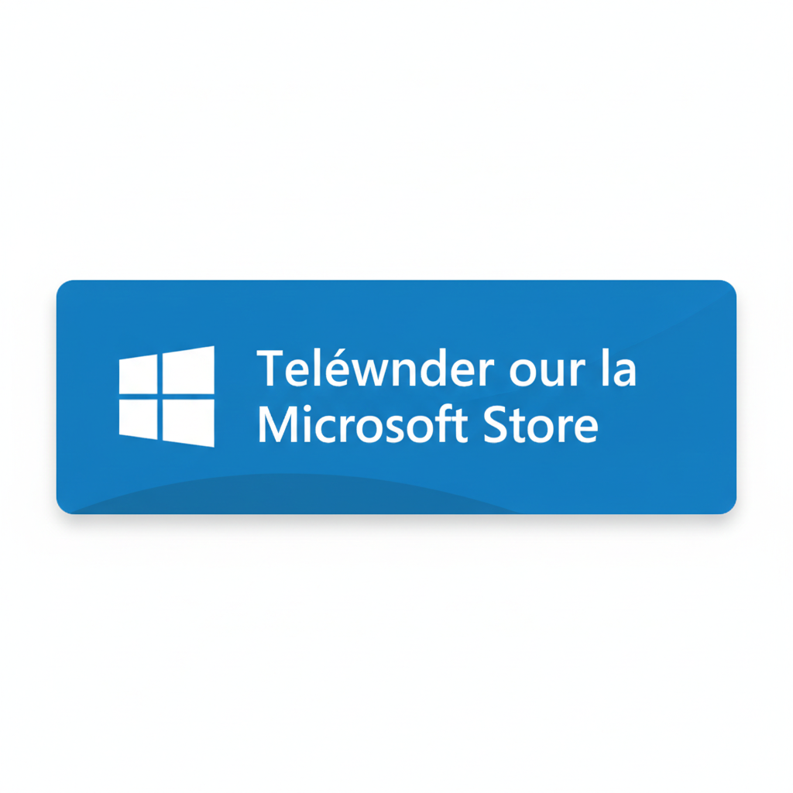

# 🚀 Software Suite Pro

Software Suite Pro est la boîte à outils ultime pour Windows, regroupant 16 modules professionnels pour optimiser, sécuriser et gérer votre système au quotidien.

## 📥 Téléchargement Officiel

Pour garantir la sécurité et l'intégrité de l'application, **Software Suite Pro est désormais disponible exclusivement sur le Microsoft Store**. 

L'installation via le Store vous permet de bénéficier :
* ✅ D'un package signé numériquement par Microsoft.
* ✅ De mises à jour automatiques et transparentes.
* ✅ D'une installation sécurisée et isolée.

[👉 Télécharger Software Suite Pro sur le Microsoft Store](ms-windows-store://pdp/?ProductId=9P2RZNR37FWV)

---

## ✨ Fonctionnalités
* **Système** : Nettoyage, Gestionnaire de disques, Monitoring CPU/RAM.
* **Fichiers** : Conversion d'images et audio, Renommage en masse, Compression ZIP.
* **Sécurité** : Coffre-fort de mots de passe (Chiffrement AES-256 local).
* **Productivité** : Prise de notes Markdown, Gestionnaire de presse-papiers.
* **Multimédia** : Enregistreur d'écran et captures annotées.

